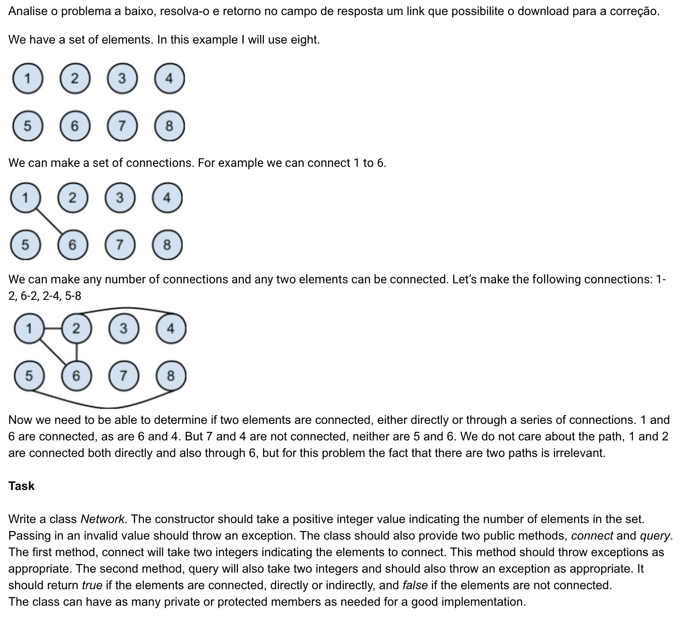

# Projeto Network

## Enunciado



Para executar o projeto, baixe o código acesse a pasta aonde o código está e execute:

```
mvn clean install
```

Este comando fará o build do projeto, irá executar os testes unitários e irá gerar o jar do projeto, depois para executar o programa utilize o seguinte comanda:

```
java -jar target/network-1.0-SNAPSHOT.jar
```

** Assumo que você já possui o java e o maven instalados e configurados.